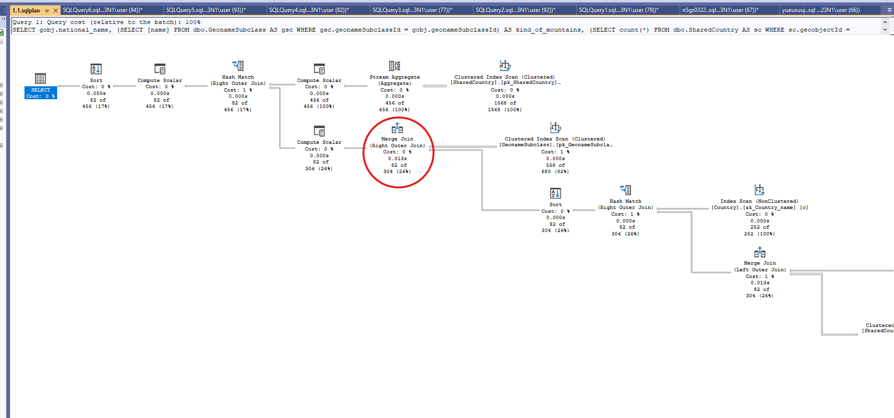
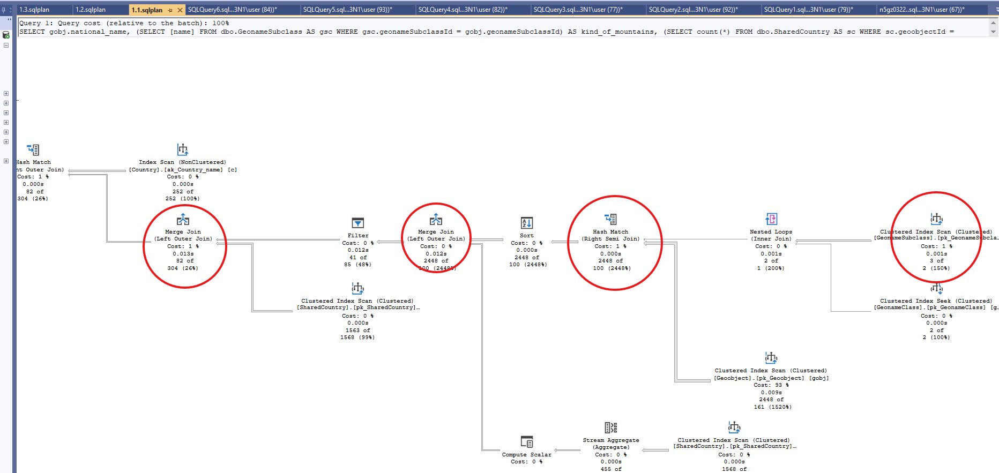
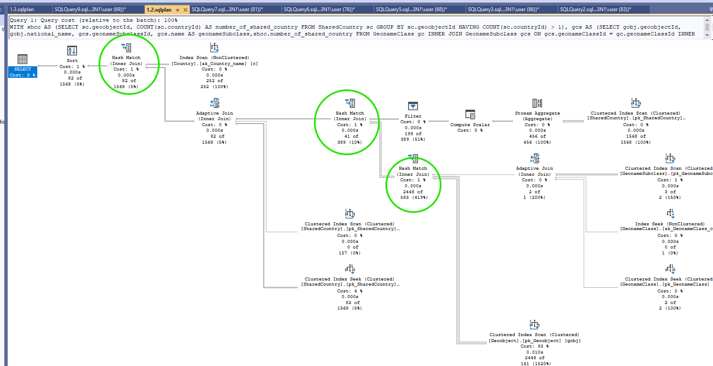
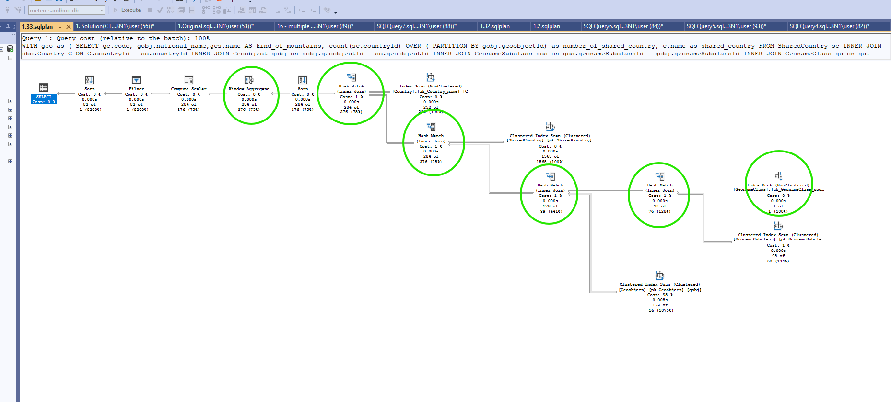
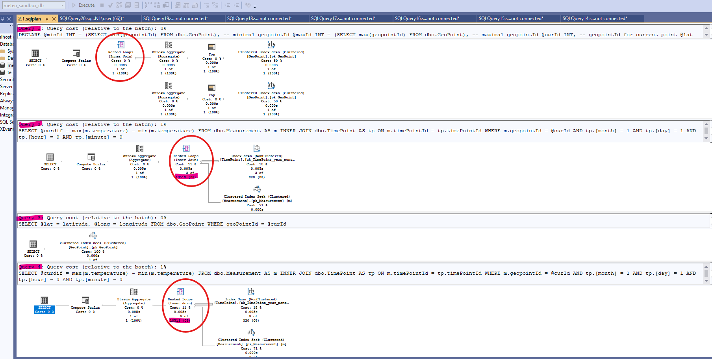
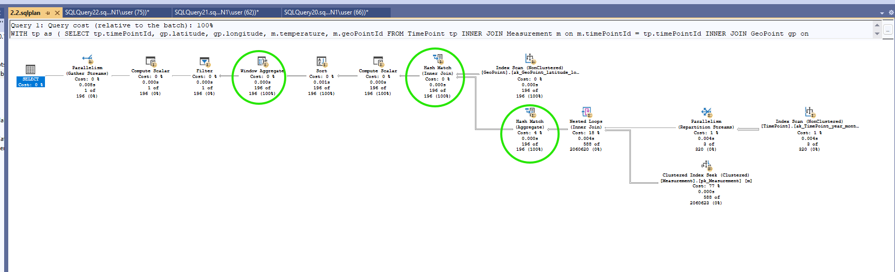

# **Homework 1**

# **Query code #1**

## <span style="color:blue">Original query</span>

```sql
SELECT gobj.national_name, 
    (SELECT [name] FROM dbo.GeonameSubclass AS gsc WHERE gsc.geonameSubclassId = gobj.geonameSubclassId) AS kind_of_mountains,
    (SELECT count(*) FROM dbo.SharedCountry AS sc WHERE sc.geoobjectId = gobj.geoobjectId) AS number_of_shared_country,
    c.[name] AS shared_country
FROM dbo.Geoobject AS gobj
LEFT JOIN dbo.SharedCountry AS sc ON sc.geoobjectId = gobj.geoobjectId
LEFT JOIN dbo.Country AS c ON sc.countryId = c.countryId
WHERE gobj.geonameSubclassId IN 
    (
        SELECT gsc.geonameSubclassId
        FROM dbo.GeonameClass AS gc
        JOIN dbo.GeonamesubClass AS gsc ON gc.geonameClassId = gsc.geonameClassId
        WHERE gc.code = 'T' AND gsc.[name] LIKE '%mountain%'
    )
    AND
    (SELECT count(*) FROM dbo.SharedCountry AS sc WHERE sc.geoobjectId = gobj.geoobjectId) > 1
ORDER BY gobj.national_name
```
## <span style="color:red">Problems in the original query:</span>


## 1.  Using subquerie 
```sql
SELECT gsc.geonameSubclassId
        FROM dbo.GeonameClass AS gc
        JOIN dbo.GeonamesubClass AS gsc ON gc.geonameClassId = gsc.geonameClassId
        WHERE gc.code = 'T' AND gsc.[name] LIKE '%mountain%'
-- correlated subqueries, code executes for every row in Geoobject        
(SELECT [name] FROM dbo.GeonameSubclass AS gsc WHERE gsc.geonameSubclassId = gobj.geonameSubclassId) AS kind_of_mountains
(SELECT count(*) FROM dbo.SharedCountry AS sc WHERE sc.geoobjectId = gobj.geoobjectId) AS number_of_shared_country
(SELECT count(*) FROM dbo.SharedCountry AS sc WHERE sc.geoobjectId = gobj.geoobjectId) > 1
-- duplication of logic, the same subquery is executed multiple times 
(SELECT count(*) FROM dbo.SharedCountry AS sc WHERE sc.geoobjectId = gobj.geoobjectId) AS number_of_shared_country
(SELECT count(*) FROM dbo.SharedCountry AS sc WHERE sc.geoobjectId = gobj.geoobjectId) > 1
```
## 2. LEFT JOIN propagation
```sql
LEFT JOIN dbo.SharedCountry -- it is not needed here,because we are interested only in Geoobjects which are shared between at least 2 countries
LEFT JOIN dbo.Country -- it is not needed here,because  we are interested in country names
```
## 3. Scan operations in filter
```sql
WHERE [name] LIKE '%mountain%' 
```
## P.S. But in this case LIKE 'mountain%', it didn’t help — the operation remained a scan. Before that, I checked the database to ensure it does not contain names GeoSubclass that include 'mountain' but do not start with 'mountain' 






## <span style="color:green">Solution: To improve performance use INNER JOIN conditions and Seek operation in filter

## *Solution 1: Using Common Table Expression (CTE)* 
```sql
WITH shcc AS (SELECT sc.geoobjectId, COUNT(sc.countryId) AS number_of_shared_country
              FROM SharedCountry sc
              GROUP BY sc.geoobjectId
              HAVING COUNT(sc.countryId) > 1), --  Geoobjects which are shared between at least 2 countries
     gcs AS (SELECT gobj.geoobjectId, gobj.national_name, gcs.geonameSubclassId, gcs.name  AS geonameSubclass,shcc.number_of_shared_country
            FROM GeonameClass gc
            INNER JOIN GeonameSubclass gcs ON gcs.geonameClassId = gc.geonameClassId
            INNER JOIN Geoobject gobj on gobj.geonameSubclassId = gcs.geonameSubclassId
            INNER JOIN shcc on shcc.geoobjectId = gobj.geoobjectId
            WHERE gc.code = 'T' and gcs.name LIKE 'mountain%') -- Shared Geoobjects that are related to a GeonameSubclass containing 'mountain' and GeonameClass with code 'T'
 SELECT gcs.national_name, gcs.geonameSubclass, gcs.number_of_shared_country,c.name from    gcs
 INNER JOIN SharedCountry sc on  sc.geoobjectId = gcs.geoobjectId
 INNER JOIN Country c on c.countryId = sc.countryId
 ORDER BY national_name;
```

## *Solution 2: Using window functions (best)*

```sql
WITH geo as (
SELECT gobj.national_name,gcs.name  AS kind_of_mountains,
        count(sc.countryId) OVER ( PARTITION BY gobj.geoobjectId) as number_of_shared_country,  -- calculate how many countries 'share' the current Geoobjects
         c.name as shared_country  FROM SharedCountry sc
INNER JOIN dbo.Country C ON C.countryId = sc.countryId
INNER JOIN Geoobject gobj on gobj.geoobjectId = sc.geoobjectId
INNER JOIN GeonameSubclass gcs on gcs.geonameSubclassId = gobj.geonameSubclassId
INNER JOIN GeonameClass gc on gc. geonameClassId=gcs.geonameClassId
WHERE gc.code = 'T') -- GeonameClass with code 'T'
SELECT * FROM geo
    where number_of_shared_country > 1 -- shared only between at least two countries
    and kind_of_mountains LIKE 'mountain%'
ORDER BY national_name   
```




# <span style="color:green"> I choose solution as the best because it has the fastest execution time. The execution plan shows that a physical Hash Join was achieved thanks to the use of INNER JOIN, and the duplication of the SharedCountry table was avoided by using window function 

# **Query code #2**

## <span style="color:blue">Original query</span>

```sql

-- Find out the maximal difference between mininum and maximum of temperature in the same point (GeoPoint) 
-- on January 1st at 00:00 for different years, show this maximal difference, longitude and latitude of corresponding point.

DECLARE 
    @minId INT = (SELECT min(geopointId) FROM dbo.GeoPoint), -- minimal geopointId
    @maxId INT = (SELECT max(geopointId) FROM dbo.GeoPoint), -- maximal geopointId
    @curId INT,             -- geopointId for current point
    @lat FLOAT,             -- latitude of GeoPoint with maximal temperature difference
    @long FLOAT,            -- longitude of GeoPoint with maximal temperature difference
    @curdif FLOAT,          -- the maximal temperature difference for current GeoPoint
    @maxdif FLOAT = 0.0     -- the maximal temperature difference throughout all points
    
SET @curId = @minId

WHILE (@curId <= @maxId)
BEGIN

    SELECT @curdif = max(m.temperature) - min(m.temperature) 
    FROM dbo.Measurement AS m 
    INNER JOIN dbo.TimePoint AS tp ON m.timePointId = tp.timePointId
    WHERE m.geopointId = @curId AND tp.[month] = 1 AND tp.[day] = 1 AND tp.[hour] = 0 AND tp.[minute] = 0

    IF @curdif > @maxdif
    BEGIN
        SET @maxdif = @curdif

        SELECT @lat = latitude, @long = longitude 
        FROM dbo.GeoPoint
        WHERE geoPointId = @curId
    END
    SET @curId = @curId + 1
END
SELECT @lat AS latitude, @long AS longitude, @maxdif AS mxdt
```
## <span style="color:red">Problems in the original query:</span>

## Imperative style. The loop repeats the same query on Measurement and TimePoint for every GeoPoint, which means the tables are scanned many times. Each statement runs separately and takes extra locks and transaction log recordings, it leads to additional time costs.




## <span style="color:green">Solution: Using declarative style (CTE + window functions)

```sql
WITH tp as (
SELECT tp.timePointId, gp.latitude, gp.longitude, m.temperature, m.geoPointId FROM TimePoint tp
INNER JOIN Measurement m on m.timePointId = tp.timePointId
INNER JOIN GeoPoint gp on gp.geoPointId=m.geoPointId
WHERE tp.month = 1 and day = 1 and tp.hour = 0 and tp.minute = 0), -- temperature measurements for 00:00 on January 1st
    res as (
SELECT tp.latitude, tp.longitude, max(tp.temperature) - min(tp.temperature) as diff, -- difference between mininum and maximum of temperature in the same point
      rank() OVER (ORDER BY max(tp.temperature) - min(tp.temperature) desc) as rank -- rank by difference in descending order
FROM tp
GROUP BY tp.geoPointId,tp.latitude, tp.longitude)
SELECT latitude, longitude, round(diff, 2)  AS mxdt FROM res
WHERE rank = 1;-- only the top GeoPoint (maximum difference)
```


