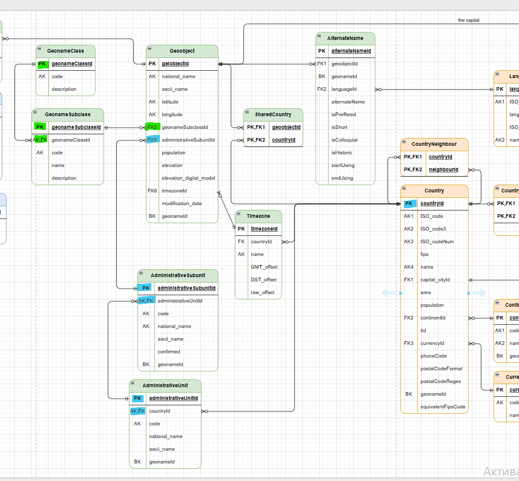
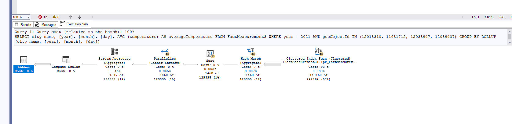

# **Homework 2 Data modelling**

# *1. The data is in the 3rd NF?*

True: Table is in **first normal form**, if each of its fields is atomic: values in fields cannot be divided into fragments that have a separate meaning. I.e. columns cannot contain multiple or composite values

True: Table is in **second normal form**, if it is in 1NF and any non-key attribute depends on entire candidate key (primary or alternate), not part of the key

False: Table is in **third normal form**, if it is in 2NF and any non-key column depends on candidate key (primary and alternate) and only on candidate key. I.e. there are no **transitive dependencies**

1. Since the Geoobject table stores both geonameSubclassId and geonameClassId, and because: geonameSubclassId → geonameClassId (i.e., knowing geonameSubclassId uniquely determines geonameClassId), a transitive dependency is formed, which violates the Third Normal Form (3NF)

<span style="color:brown; font-size:12px;">REMARKS</span>
There is inconsistency in the database because some rows have geonameClassId defined while geonameSubclassId is NULL.
```sql
SELECT * FROM Geoobject gobj
WHERE gobj.geonameSubclassId is NULL
and gobj.geonameClassId is NOT NULL;-- returns 2 rows 
```
After normalization, only geonameSubclassId will remain, which means that for the rows mentioned above, the information about geonameClassId will be lost.

2. Since the Geoobject table stores both administrativeSubunitId and administrativeUnitId, and because:
administrativeSubunitId → administrativeUnitId (i.e., knowing administrativeSubunitId uniquely determines administrativeUnitId),
a transitive dependency is formed, which violates the Third Normal Form (3NF).

<span style="color:brown; font-size:12px;">REMARKS</span>
There is inconsistency in the database because some rows where administrativeUnitId is defined, but administrativeSubunitId is NULL.
```sql
SELECT * FROM Geoobject gobj
WHERE administrativeUnitId is not null
AND administrativeSubunitId is  null;-- returns 44 665 rows
```
The number of rows is large, which may indicate a mismatch in the data model for storing this data.
After normalization, only administrativeSubunitId will remain, the information for rows where only administrativeUnitId is specified (without administrativeSubunitId) will be lost.

3. Since the Geoobject table stores both administrativeUnitId and countryId, and because:
administrativeUnitId → countryId (i.e., knowing administrativeUnitIdd uniquely determines countryId),
a transitive dependency is formed, which violates the Third Normal Form (3NF).

<span style="color:brown; font-size:12px;">REMARKS</span>
There is inconsistency in the database because some rows where countryId is defined, but administrativeUnitId is NULL.
```sql
SELECT * FROM Geoobject gobj
WHERE countryId is not null
AND administrativeSubunitId is  null
AND administrativeUnitId is  null; -- returns 3 679 rows
```
After normalization, only administrativeUnitId will remain, the information for rows where only countryId is specified (without administrativeSubunitId and administrativeUnitId) will be lost.
+ 
There are records for which it is impossible to determine the country.
```sql
SELECT * FROM Geoobject gobj
WHERE countryId is null
AND administrativeSubunitId is  null
AND administrativeUnitId is  null; -- returns 114 rows
```

It is also worth noting that denormalization might be more advantageous in this case in terms of better performance for subsequent queries. Having the secondary key countryId in the Geoobject table allows determining the country of a Geoobject directly, without extra joins, and also enables identifying shared Geoobjects (the SharedCountry table has a composite key geoobjectId + countryId).


## <span style="color:green">Solution: To bring schema into Third Normal Form (3NF), remove all transitive dependencies by storing only the lowest level of each relationship and deriving all other values through foreign keys. Data model after all transformation (3NF)



# *2.Classification of the sandbox DB model in terms of OLAP/OLTP system*

The sandbox database model is closer to OLAP. It is designed for analysis and reports, working with historical data, not for everyday business transactions (like individual measurements). This lets us see how measurements change over time in different geographical objects (cities).
Most tables are normalized (like in OLTP), so analysis is harder and needs many JOINs to calculate aggregates like AVG, SUM, or GROUP BY. Denormalized tables or views need to be used to make analysis easier.

OLAP Data Models - Snowflake Schema. This is because the schema includes a fact table — Measurement — and several related normalized tables (geoPointId → GeoObjectGeoPoint → GeoObject) that provide dimensional information and require additional JOINs.

OLAP Type (Storage Model) - Relational OLAP (ROLAP). This is because fact table(Measurement)  and dimension tables(TimePoint ,geoPointId → GeoObjectGeoPoint → GeoObject) are stored in relational database, aggregated values can be precomputed.

# *3. Is the structure around Measurement optimal to retrieve aggregated measurement information?*

The current structure is not optimal for analytics. It is normalized and requires many JOINs to calculate aggregates like average temperature by cities and countries. For faster analysis, a denormalized table or view with city and country names, IDs, and time columns should be used. I chose a table, which is more versatile than dbo.view_TemperatureMeasurement, to analyze not only temperature but also other measurements.
It should be noted that when data changes, the table needs to be kept up to date.

## *Step 1: Create and load a new denormalized table* 
A new denormalized table FactMeasurement is created and loaded with data, designed to be optimal for retrieving aggregated measurement information by cities, countries, and time.
```sql
SELECT 
    m.geoPointId,
    m.timePointId,
    gob.geoObjectId,
    gob.national_name AS city_name,
    c.countryId AS country_id,
    c.name AS country_name,
    tp.[year],
    tp.[month],
    tp.[day],
    tp.[hour],
    tp.minute,
    m.cloudTypeId,
    m.relativeHumidity,
    m.pressure,
    m.fillFlagId,
    m.temperature,
    m.windDirection,
    m.windSpeed
INTO dbo.FactMeasurement
FROM dbo.Measurement AS m
INNER JOIN dbo.GeoObjectGeoPoint AS gogp ON gogp.geoPointId = m.geoPointId
INNER JOIN dbo.GeoObject AS gob ON gob.geoObjectId = gogp.geoObjectId
INNER JOIN dbo.Country AS c ON c.countryId = gob.countryId
INNER JOIN dbo.TimePoint AS tp ON tp.timePointId = m.timePointId;
```
## *Step 2: Create indexes for the table*
```sql
ALTER TABLE dbo.FactMeasurement
ADD CONSTRAINT pk_FactMeasurement PRIMARY KEY (timePointId, geoObjectId);

CREATE INDEX idx_FactMeasurement_City
ON dbo.FactMeasurement (geoObjectId);

CREATE INDEX idx_FactMeasurement_Country
ON dbo.FactMeasurement (country_id);

CREATE INDEX idx_FactMeasurement_Date
ON dbo.FactMeasurement (year, month, day);

CREATE INDEX idx_FactMeasurement_CityName
ON dbo.FactMeasurement (city_name);
```

Query from example using the new table
```sql
SELECT
    city_name, [year], [month], [day],
    AVG (temperature) AS averageTemperature
FROM FactMeasurement
WHERE year = 2021
AND geoObjectId IN (12018310, 11931712, 12033947, 12089437)
GROUP BY ROLLUP (city_name, [year], [month], [day])  ;
```


# *4. Rewriting the query based on regular GROUP BY operatioт*

## *Solution 1: GROUP BY + UNION ALL* 
```sql
SELECT
        city_name, [year], [month], [day],
        AVG (temperature) AS averageTemperature
FROM dbo.view_TemperatureMeasurement
GROUP BY city_name, [year], [month], [day]
UNION ALL
SELECT
        city_name, [year], [month], NULL,
        AVG (temperature) AS averageTemperature
FROM dbo.view_TemperatureMeasurement
GROUP BY city_name, [year], [month]
UNION ALL
SELECT
        city_name, [year], NULL, NULL,
        AVG (temperature) AS averageTemperature
FROM dbo.view_TemperatureMeasurement
GROUP BY city_name, [year]
UNION ALL
SELECT
        city_name, NULL, NULL, NULL,
        AVG (temperature) AS averageTemperature
FROM dbo.view_TemperatureMeasurement
GROUP BY city_name
UNION ALL
SELECT
        NULL, NULL, NULL, NULL,
        AVG (temperature) AS averageTemperature
FROM dbo.view_TemperatureMeasurement;
```

## *Solution 2: GROUPING SETS* 
```sql
SELECT
        city_name, [year], [month], [day],
        AVG (temperature) AS averageTemperature
FROM dbo.view_TemperatureMeasurement
GROUP BY GROUPING SETS (
    (city_name, [year], [month], [day]),
    (city_name, [year], [month]),
    (city_name, [year]),
    (city_name),
    ()
    );
```