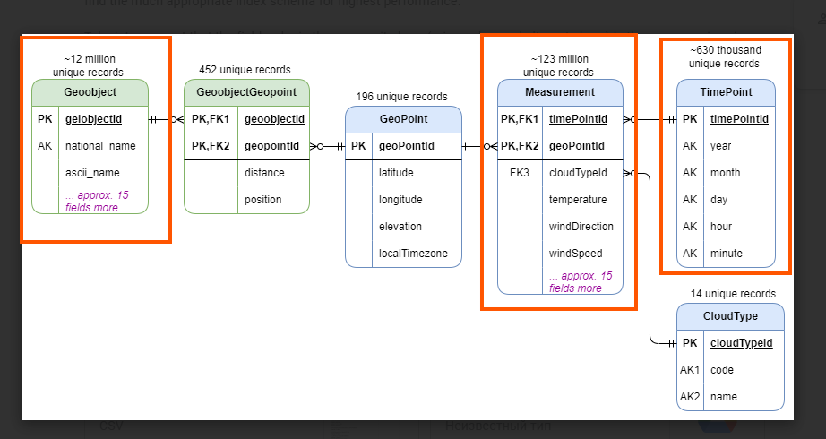
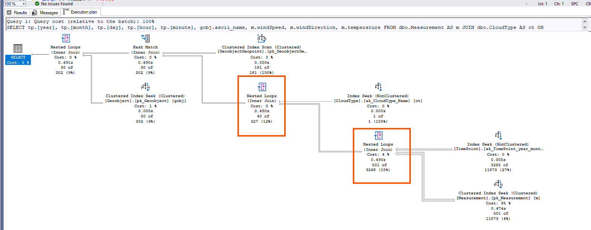
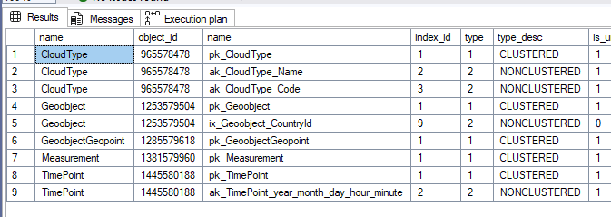
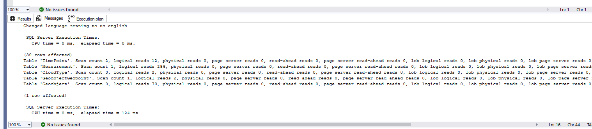
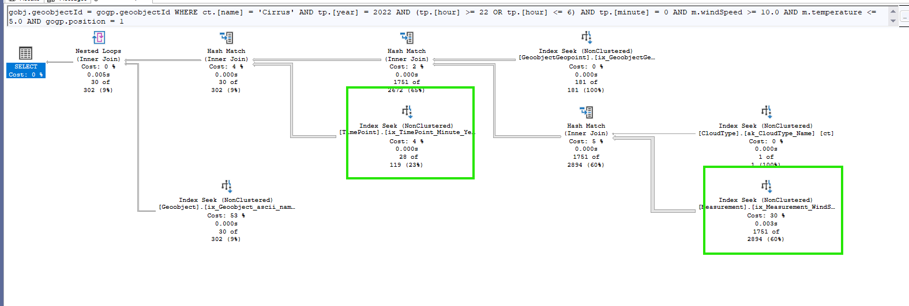
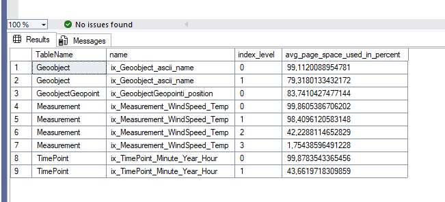
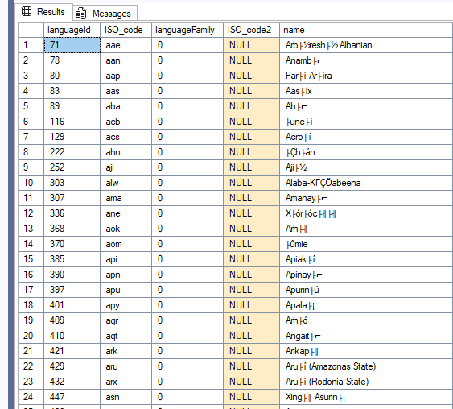
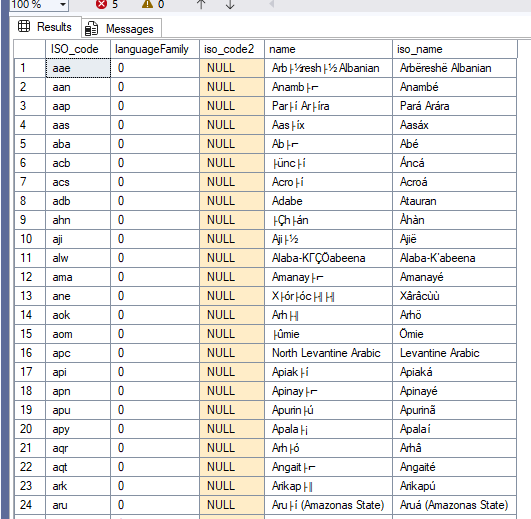
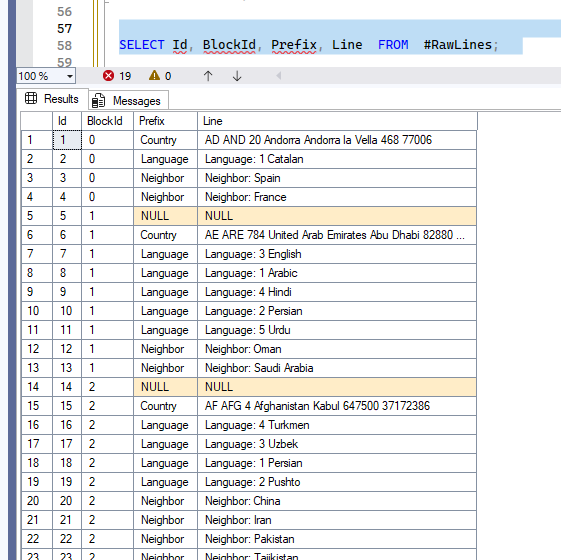
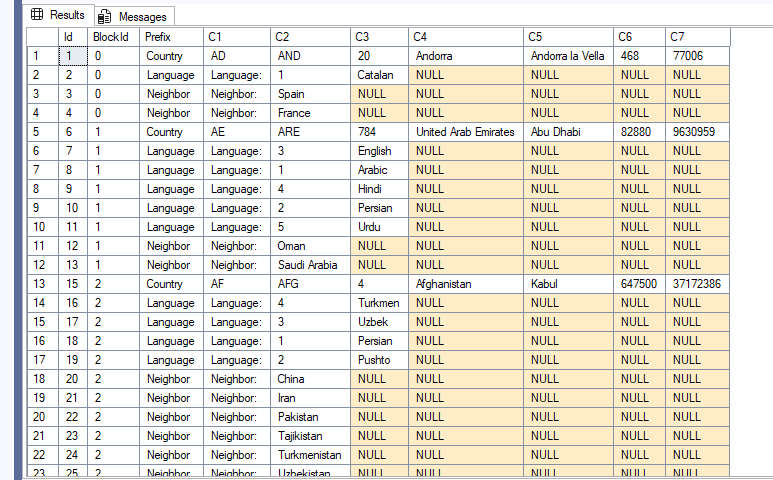

# **Homework 3 Indexing and ETL/ELT**

# *1.  Which additional indexes (besides those implicitly created by SQL Server) would you create to improve the performance of the query?*

## *Step 1: Analysis and creating indexes* 

When looking at the logical model, the best candidates for new indexes are the tables dbo.Measurement, dbo.Geoobject, and dbo.TimePoint.
These tables have the most rows, and Measurement and Geoobject also contain many columns that the query does not use.



First, we record the initial query performance and execution plan (before new indexes):

 - Table 'Geoobject'           logical reads: 100
 - Table 'Measurement'         logical reads: 21697
 - Table 'TimePoint'           logical reads: 73
 - Table 'CloudType'           logical reads: 2
 - Table 'GeoobjectGeopoint'   logical reads: 4

   CPU time = 469 ms, elapsed time = 675 ms.



We also check which indexes already exist:
```sql
SELECT o.name, i.*
FROM sys.objects o
JOIN sys.indexes i ON i.object_id = o.object_id
WHERE o.name IN ('Measurement','CloudType','TimePoint','GeoObjectGeoPoint','Geoobject')
ORDER BY o.name;
```


a) dbo.Measurement

Columns used:

 - SELECT: windSpeed, windDirection, temperature
 - JOIN: cloudTypeId, timePointId, geoPointId
 - WHERE: windSpeed, temperature

The clustered index pk_Measurement contains only (timePointId, geoPointId).
We need a nonclustered index on windSpeed and temperature because they filter rows.We also add covering columns so SQL Server does not go back to the clustered index.
Selectivity check:
```sql
SELECT count(*) FROM Measurement WHERE windSpeed >= 10; -- returns 61,139 rows
SELECT count(*) FROM Measurement WHERE temperature <= 5; -- returns 4,615,184 rows
```

windSpeed is more selective, put it first.
```sql
CREATE NONCLUSTERED INDEX ix_Measurement_WindSpeed_Temp
ON Measurement (windSpeed, temperature)
INCLUDE (timePointId, geoPointId, cloudTypeId, windDirection);
```
b) dbo.Geoobject

 Columns used:

 - SELECT: ascii_name
 - JOIN: geoobjectId

The existing clustered index on geoobjectId is not enough, and other indexes are not used. We need an index on geoobjectId that covers ascii_name.
```sql
CREATE NONCLUSTERED INDEX ix_Geoobject_ascii_name
ON Geoobject (geoobjectId)
INCLUDE (ascii_name);
```
c) dbo.TimePoint

Columns used:

 - SELECT: year, month, day, hour, minute
 - JOIN: timePointId
 - WHERE: year, hour, minute

There is an existing index on (year, month, day, hour, minute), but it is wide. We only filter by year, hour, minute, so a smaller index will perform better.

Selectivity:
```sql
SELECT count(*) FROM TimePoint WHERE year = 2022;   -- 35040
SELECT count(*) FROM TimePoint WHERE minute = 0;    -- 26280
```
minute is slightly more selective, put minute first.

```sql
CREATE NONCLUSTERED INDEX ix_TimePoint_Minute_Year_Hour
ON TimePoint (minute, year, hour)
INCLUDE (month, day, timePointId);
```

d) dbo.GeoobjectGeopoint

Columns used:

 - JOIN: geopointId, geoobjectId
 - WHERE: position

The table is small, so even a simple index on position is enough.

Two options:
```sql
CREATE NONCLUSTERED INDEX ix_GeoobjectGeopointi_position
ON GeoobjectGeopoint (position, geopointId)
INCLUDE (geoobjectId);
```

or (similar performance):

```sql
CREATE NONCLUSTERED INDEX ix_GeoobjectGeopointi_position_v2
ON GeoobjectGeopoint (position);
```

e) dbo.CloudType

Columns used:

 - JOIN: cloudTypeId
 - WHERE: name

The table is small and already has an index on name. No additional index is needed (exist ak_CloudType_Name).

## *Step 2: Checking index efficiency and Performance improvement* 

| Before | After |
|--------|-------|
| Table 'Geoobject'. Scan count 0, logical reads 100 | Table 'Geoobject'. Scan count 0, logical reads 70 |
| Table 'Measurement'. Scan count 3285, logical reads 21697 | Table 'Measurement'. Scan count 1, logical reads 256 |
| Table 'TimePoint'. Scan count 1, logical reads 73 | Table 'TimePoint'. Scan count 2, logical reads 12 |
| Table 'CloudType'. Scan count 0, logical reads 2 | Table 'CloudType'. Scan count 0, logical reads 2 |
| Table 'GeoobjectGeopoint'. Scan count 1, logical reads 4 | Table 'GeoobjectGeopoint'. Scan count 1, logical reads 2 |
| CPU time = 469 ms, elapsed time = 675 ms | CPU time = 15 ms, elapsed time = 124 ms |





```sql
SELECT
    OBJECT_NAME(i.object_id) AS TableName,
    i.name, ips.index_level,
    ips.avg_page_space_used_in_percent
FROM sys.dm_db_index_physical_stats(DB_ID(), null, null, null, 'detailed') AS ips
JOIN sys.indexes i ON ips.object_id = i.object_id AND ips.index_id = i.index_id
WHERE i.name IN (
    'ix_Measurement_WindSpeed_Temp',
    'ix_GeoobjectGeopointi_position',
    'ix_TimePoint_Minute_Year_Hour',
    'ix_Geoobject_ascii_name'
);
```


# <span style="color:green">Summary:The query became much faster and more efficient. 
Creating these additional indexes greatly improved the performance of the query by:
 - reducing logical reads on the largest tables
 - avoiding unnecessary key lookups
 - reducing scan counts
 - lowering CPU and elapsed time

 

# *2.  Perform data profiling for table dbo.Language from meteo_sandbox_db  database consider it is a row data*

## *Step 1: Examining and analyzing data* 
In the table dbo.Language there are 4 columns. I will review each of them (assuming the data is raw and existing column constraints are ignored).
For validation rules, I use the rules and examples from https://www.iso.org/iso-639-language-code
1) languageId
Checks:
 - data does not contain nulls
 - data is unique and without gaps
 - contains only numbers

```sql
SELECT *
FROM dbo.Language
WHERE languageId IS NULL;  -- returns 0 rows

SELECT languageId, COUNT(*)
FROM dbo.Language
GROUP BY languageId
HAVING COUNT(*) > 1;  -- returns 0 rows

WITH Language2 AS (
    SELECT languageId,
           LEAD(languageId) OVER (ORDER BY languageId) AS nextID,
           LEAD(languageId) OVER (ORDER BY languageId) - languageId AS gap
    FROM dbo.Language
)
SELECT *
FROM Language2
WHERE gap > 1;  -- returns 0 rows
```
2) ISO_code

Checks:
 - does not contain null
 - unique
 - only English alphabet letters
 - length = 3

```sql
SELECT *
FROM Language
WHERE ISO_code IS NULL
   OR LEN(ISO_code) != 3
   OR ISO_code LIKE '%[^a-z]%';  -- returns 0 rows

SELECT ISO_code, COUNT(*)
FROM dbo.Language
GROUP BY ISO_code
HAVING COUNT(*) > 1;  -- returns 0 rows
```
3) ISO_code2

Checks:
 - % of data that contains null
 - unique
 - only English alphabet letters 
 - length = 2

```sql
SELECT *
FROM Language
WHERE LEN(ISO_code2) != 2
   OR ISO_code2 LIKE '%[^a-z]%'; -- returns 0 rows

SELECT ISO_code2, COUNT(*)
FROM dbo.Language
WHERE ISO_code2 is not NULL
GROUP BY ISO_code2
HAVING COUNT(*) > 1;  -- returns 0 rows
```
The column may contain nulls (as in the example https://www.loc.gov/standards/iso639-2/php/code_list.php), so I check the percentage:

```sql
SELECT COUNT(languageId) FROM Language;  -- 7925

SELECT ROUND(COUNT(languageId)/7925.0 * 100, 2)
FROM Language
WHERE ISO_code2 IS NULL;  -- 97.67%
```

The percentage is very high. If we do not plan to use this value later, we may exclude this column from import (low information value).

4) languageFamily

Checks:
 - no nulls
 - contains only true/false
 - for names containing “languages” the flag cannot be “false”

```sql
SELECT *
FROM Language
WHERE languageFamily IS NULL; -- returns 0 rows

SELECT *
FROM Language
WHERE languageFamily NOT IN (0, 1); -- returns 0 rows

SELECT *
FROM Language
WHERE name LIKE '%languages%'
  AND languageFamily = 'false'; -- returns 0 rows

SELECT languageFamily,
       ROUND(COUNT(languageId)/7925.0 * 100, 2)
FROM Language
GROUP BY languageFamily;
```
Most languages (99.17%) are not language families, which is correct.
However, it’s unclear how this fact can be used analytically.

5) name

Checks:
 - no nulls
 - unique
 - min/max length
 - contains only English alphabet letters and digits

```sql
SELECT *
FROM Language
WHERE name IS NULL; -- returns 0 rows

SELECT name
FROM Language
GROUP BY name
HAVING COUNT(*) > 1; -- returns 0 rows

WITH lenName AS (
    SELECT MAX(LEN(name)) AS maxLen,
           MIN(LEN(name)) AS minLen
    FROM Language
)
SELECT *
FROM Language
WHERE LEN(name) = (SELECT maxLen FROM lenName)
   OR LEN(name) = (SELECT minLen FROM lenName)
ORDER BY LEN(name);
```

The results show extreme name lengths:

ISO_code | name
eee      | E
uuu      | U
ina      | Interlingua (International Auxiliary Language Association)


I check ISO reference; these languages exist, names are correct.
https://iso639-3.sil.org/code_tables/639/data/all?title=eee&field_iso639_cd_st_mmbrshp_639_1_tid=All&name_3=&field_iso639_element_scope_tid=All&field_iso639_language_type_tid=All&items_per_page=200

Then I check characters:

```sql
SELECT *
FROM Language
WHERE name LIKE '%[^A-Za-z]%';
```

The result shows issues — alphabet-only constraint is too strict.
I extend allowed characters:

```sql
SELECT *
FROM Language
WHERE name LIKE '%[^A-Za-z ''-().,;0-9]%';
```

Now I see encoding issues — some names contain corrupted characters.




## *Step 2: Fixing data using ISO sources*

Let’s try to restore the data using the official ISO 639 source:
https://www.iso.org/iso-639-language-code

1) Download Set 3 (it includes all individual languages from Sets 1 and 2) and load it into a temporary table TempIsoSet3

Download:
https://iso639-3.sil.org/sites/iso639-3/files/downloads/iso-639-3.tab

```sql
CREATE TABLE dbo.TempIsoSet3 (
    Id NVARCHAR(10),
    Part2b NVARCHAR(10),
    Part2t NVARCHAR(10),
    Part1 NVARCHAR(10),
    Scope NVARCHAR(10),
    Language_Type NVARCHAR(10),
    Ref_Name NVARCHAR(200),
    Comment NVARCHAR(200)
);

BULK INSERT dbo.TempIsoSet3
FROM 'C:\data\iso-639-3.tab'
WITH (
    FIELDTERMINATOR = '\t',
    ROWTERMINATOR = '0x0a',
    FIRSTROW = 2,
    CODEPAGE = '65001',
    TABLOCK
);
```

2) Download Set 5 (language families and groups) and load it into TempIsoSet5

Download:
https://id.loc.gov/vocabulary/iso639-5.tsv

```sql
CREATE TABLE dbo.TempIsoSet5 (
    URI NVARCHAR(200),
    code NVARCHAR(10),
    Label_English NVARCHAR(200),
    Label_French NVARCHAR(200)
);

BULK INSERT dbo.TempIsoSet5
FROM 'C:\data\iso639-5.tsv'
WITH (
    FIELDTERMINATOR = '\t',
    ROWTERMINATOR = '0x0A',
    FIRSTROW = 2,
    CODEPAGE = '65001'
);
```
3) Compare the combined data from Set 3 + Set 5 with the existing Language table.

a) Checking iso_code2

I merge the two datasets and compare values with the Language table.

```sql
WITH iso AS (
    SELECT code AS id, Label_English AS name, NULL AS iso_code2, 'true' AS languageFamily -- because Set 5 contains language families and groups
    FROM TempIsoSet5
    UNION
    SELECT id, Ref_Name AS name, Part1 AS iso_code2, 'false' AS languageFamily
    FROM TempIsoSet3
)
SELECT *
FROM Language l
LEFT JOIN iso ON l.ISO_code = iso.id
WHERE l.iso_code2 != iso.iso_code2
ORDER BY id; -- returns 0 rows, meaning all iso_code2 values match.
```
b) Compare languageFamily

```sql
WITH iso AS (
    SELECT code as id , Label_English as name, NULL as ISO_code2, 'true' as languageFamily
    FROM TempIsoSet5
    UNION
    SELECT id as id, Ref_Name as name, Part1 as ISO_code2, 'false' as languageFamily
    FROM TempIsoSet3
)
SELECT *
FROM Language l
LEFT JOIN iso ON l.ISO_code = iso.id
WHERE l.languageFamily <> iso.languageFamily
ORDER BY id;-- returns 0 rows, meaning all languageFamily values match.
```
c) Find ISO codes that no longer exist (Deprecated languages)

```sql
WITH iso AS (
    SELECT code as id , Label_English as name, NULL as ISO_code2, 'true' as languageFamily
    FROM TempIsoSet5
    UNION
    SELECT id as id, Ref_Name as name, Part1 as ISO_code2, 'false' as languageFamily
    FROM TempIsoSet3
)
SELECT *
FROM Language l
LEFT JOIN iso ON l.ISO_code = iso.id
WHERE iso.id IS NULL
ORDER BY l.ISO_code;
```

I checked each code in the Deprecated Codes list:
https://iso639-3.sil.org/code_tables/deprecated_codes/data

Almost all of them are deprecated (except 'him').
I will add a column deprecated and mark these codes as deprecated. Optionally, I can either delete the deprecated data or just flag it in the table.

```sql
WITH iso AS (
    SELECT code as id , Label_English as name, NULL as ISO_code2, 'true' as languageFamily
    FROM TempIsoSet5
    UNION
    SELECT id as id, Ref_Name as name, Part1 as ISO_code2, 'false' as languageFamily
    FROM TempIsoSet3
), fix AS (
SELECT l.ISO_code, l.name
FROM Language l
LEFT JOIN iso ON l.ISO_code = iso.id
WHERE iso.id IS NULL
AND l.ISO_code != 'him')
UPDATE l
SET deprecated = 1
FROM Language l
INNER JOIN fix on fix.ISO_code=l.ISO_code
```

If possible, you can not only mark the values as deleted but also remove them from the table, after first verifying that the deleted languages are not used as references in any other tables.
```sql
SELECT * FROM Language l
INNER JOIN dbo.CountryLanguage cl ON l.languageId = cl.languageId
WHERE l.deprecated = 'true'; -- returns 0 rows
```
(AlternateName is not created as a table in the test database, but it exists in the schema, so the query cannot be executed on the test database.) 
```sql
SELECT * FROM Language l
INNER JOIN AlternateName a on l.languageId = a.languageId
WHERE l.deprecated = 'true'; -- returns 0 rows
```

```sql
DELETE FROM Language
WHERE deprecated = 'true';
```

d) Find missing values that I can enrich

```sql
WITH iso AS (
    SELECT code as id , Label_English as name, NULL as ISO_code2, 'true' as languageFamily
    FROM TempIsoSet5
    UNION
    SELECT id as id, Ref_Name as name, Part1 as ISO_code2, 'false' as languageFamily
    FROM TempIsoSet3
)
SELECT iso.id, iso.languageFamily, iso.iso_code2, iso.name
FROM iso
LEFT JOIN Language l ON l.ISO_code = iso.id
WHERE l.ISO_code IS NULL
ORDER BY l.ISO_code;
```

These rows can be inserted into the table for enrichment.

```sql
WITH iso AS (
    SELECT code as id , Label_English as name, NULL as ISO_code2, 'true' as languageFamily
    FROM TempIsoSet5
    UNION
    SELECT id as id, Ref_Name as name, Part1 as ISO_code2, 'false' as languageFamily
    FROM TempIsoSet3
)
 INSERT INTO Language (ISO_code, languageFamily, ISO_code2, name,  deprecated )
 (
SELECT iso.id, iso.languageFamily, iso.iso_code2, iso.name,'false' as deprecated
FROM iso
LEFT JOIN Language l ON l.ISO_code = iso.id
WHERE l.ISO_code IS NULL);
```
e) Fix corrupted names

```sql
WITH iso as (
    SELECT code as id , Label_English as name, NULL as ISO_code2, 'true' as languageFamily
    FROM TempIsoSet5
    UNION
    SELECT id as id, Ref_Name as name, Part1 as ISO_code2, 'false' as languageFamily
    FROM TempIsoSet3
)
SELECT l.ISO_code, l.languageFamily, l.iso_code2, l.name, iso.name as iso_name FROM iso  
INNER JOIN Language l on l.ISO_code=iso.id
         WHERE iso.name != l.name
ORDER BY l.ISO_code;
```


The result shows rows with encoding errors. The solution is to fix the names without losing the original data. I will create a copy of the "name" column - "name_fix" in the Language table and update the corrected values there.

```sql
ALTER TABLE Language
ADD name_fix NVARCHAR(200);

UPDATE Language
SET name_fix = name;
```

Update name_fix:

```sql
WITH iso AS (
    SELECT code as id , Label_English as name, NULL as ISO_code2, 'true' as languageFamily
    FROM TempIsoSet5
    UNION
    SELECT id as id, Ref_Name as name, Part1 as ISO_code2, 'false' as languageFamily
    FROM TempIsoSet3
),
fix AS (
    SELECT l.ISO_code, iso.name
    FROM Language l
    LEFT JOIN iso ON l.ISO_code = iso.id
    WHERE l.name <> iso.name
)
UPDATE l
SET l.name_fix = fix.name
FROM Language l
JOIN fix ON fix.ISO_code = l.ISO_code;
```

# *2.  Write SQL code which loads data into temporary table from countries_for_import.csv file*


1) Load all lines from countries_for_import.csv into a temporary table #RawLines.
Each line from the file becomes one record in the table.

```sql
CREATE TABLE #RawLines (
    Line NVARCHAR(MAX)
);

BULK INSERT #RawLines
FROM 'C:\data\countries_for_import.csv'
WITH (
    ROWTERMINATOR = '0x0A',
    FIELDTERMINATOR = '\t',
    CODEPAGE = '65001',
    DATAFILETYPE = 'char'
);
```

2) Add an auto-increment ID to keep the original order

```sql
ALTER TABLE #RawLines
ADD Id INT IDENTITY(1,1);
```

3) Identify countries by grouping lines into blocks

I noticed that the file separates data for each country with a blank line.
So I calculate a BlockId: every time SQL sees an empty line, it increases the block number.

```sql
ALTER TABLE #RawLines
ADD BlockId INT;

WITH Blocks AS (
    SELECT *,
           BlockIdCalc = SUM(
               CASE WHEN Line IS NULL THEN 1 ELSE 0 END
           ) OVER (ORDER BY Id)
    FROM #RawLines
)
UPDATE r
SET BlockId = b.BlockIdCalc
FROM #RawLines r
JOIN Blocks b ON r.Id = b.Id;
```

4) Add Prefix column: Country, Language, or Neighbor

I check the beginning of each line:
If it starts with "Language" → Prefix = Language
If it starts with "Neighbor" → Prefix = Neighbor
If the line has data but doesn’t start with those words → Prefix = Country
If the line is empty → Prefix = NULL

This makes it easy to understand what type of data each line contains.

```sql
ALTER TABLE #RawLines
ADD Prefix NVARCHAR(20);

UPDATE #RawLines
SET Prefix = CASE
                WHEN LEFT(Line, 8) = 'Language' THEN 'Language'
                WHEN LEFT(Line, 8) = 'Neighbor' THEN 'Neighbor'
                WHEN Line IS NOT NULL AND LTRIM(RTRIM(Line)) <> '' THEN 'Country'
                ELSE NULL
             END;
```             
Query result

```sql
SELECT Id, BlockId, Prefix, Line  FROM  #RawLines;
```



5) Split lines into columns by TAB and save results in #RawLinesSplit with columns C1–C7.

I split the text in the Line column using TAB as a delimiter.
But the number of expected columns depends on the Prefix:
Country lines → 7 columns
Language lines → 3 columns
Neighbor lines → 2 columns

```sql
CREATE TABLE #RawLinesSplit (
    Id INT,
    BlockId INT,
    Prefix NVARCHAR(20),
    C1 NVARCHAR(200),
    C2 NVARCHAR(200),
    C3 NVARCHAR(200),
    C4 NVARCHAR(200),
    C5 NVARCHAR(200),
    C6 NVARCHAR(200),
    C7 NVARCHAR(200)
);

WITH Split AS (
    SELECT
        r.Id,
        r.BlockId,
        r.Prefix,
        value AS ColValue,
        ROW_NUMBER() OVER(PARTITION BY r.Id ORDER BY (SELECT NULL)) AS ColNum
    FROM #RawLines r
    CROSS APPLY STRING_SPLIT(r.Line, CHAR(9))
)
INSERT INTO #RawLinesSplit(Id, BlockId, Prefix, C1, C2, C3, C4, C5, C6, C7)
SELECT
    Id,
    BlockId,
    Prefix,
    MAX(CASE WHEN ColNum = 1 THEN ColValue END) AS C1,
    MAX(CASE WHEN ColNum = 2 THEN ColValue END) AS C2,
    MAX(CASE WHEN ColNum = 3 THEN ColValue END) AS C3,
    MAX(CASE WHEN ColNum = 4 THEN ColValue END) AS C4,
    MAX(CASE WHEN ColNum = 5 THEN ColValue END) AS C5,
    MAX(CASE WHEN ColNum = 6 THEN ColValue END) AS C6,
    MAX(CASE WHEN ColNum = 7 THEN ColValue END) AS C7
FROM Split
GROUP BY Id, BlockId, Prefix
ORDER BY Id;
```
Query result

```sql
SELECT *  FROM  #RawLinesSplit
ORDER BY Id;
```



6) For all Language and Neighbor rows, fill ISO2 (in C1) from Country rows in the same block
Each original line becomes one structured row.

```sql
WITH CountryISO AS (
    SELECT BlockId, C1 AS ISO2
    FROM #RawLinesSplit
    WHERE Prefix = 'Country'
)
UPDATE r
SET C1 = c.ISO2
FROM #RawLinesSplit r
JOIN CountryISO c ON r.BlockId = c.BlockId
WHERE r.Prefix IN ('Language', 'Neighbor');
```

7) View final prepared data

```sql
SELECT Prefix, C1, C2, C3, C4, C5, C6, C7
FROM #RawLinesSplit
ORDER BY Id;
```